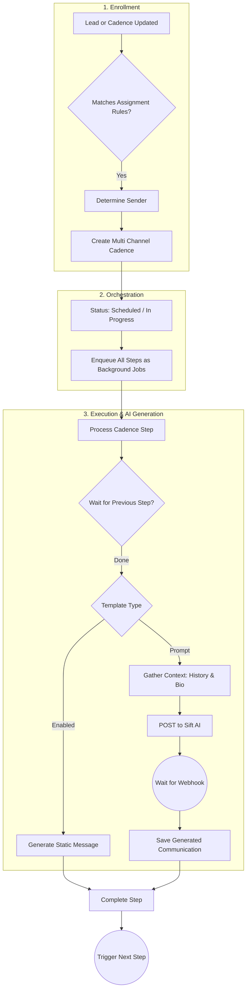
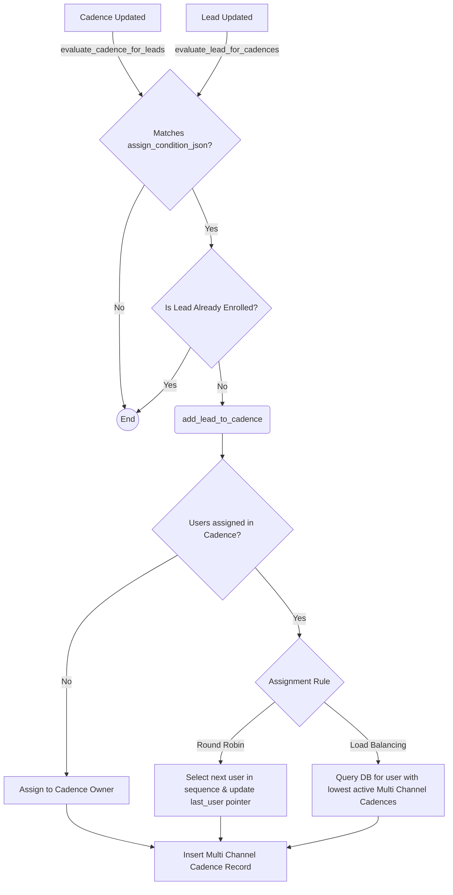
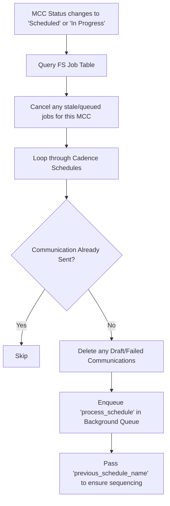
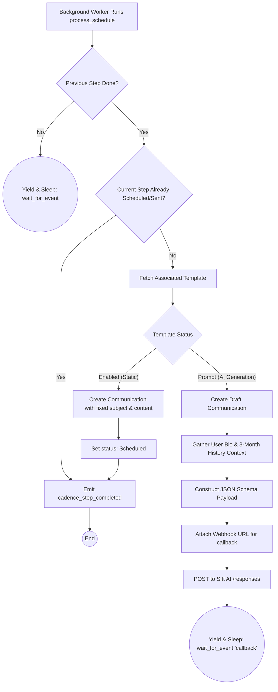
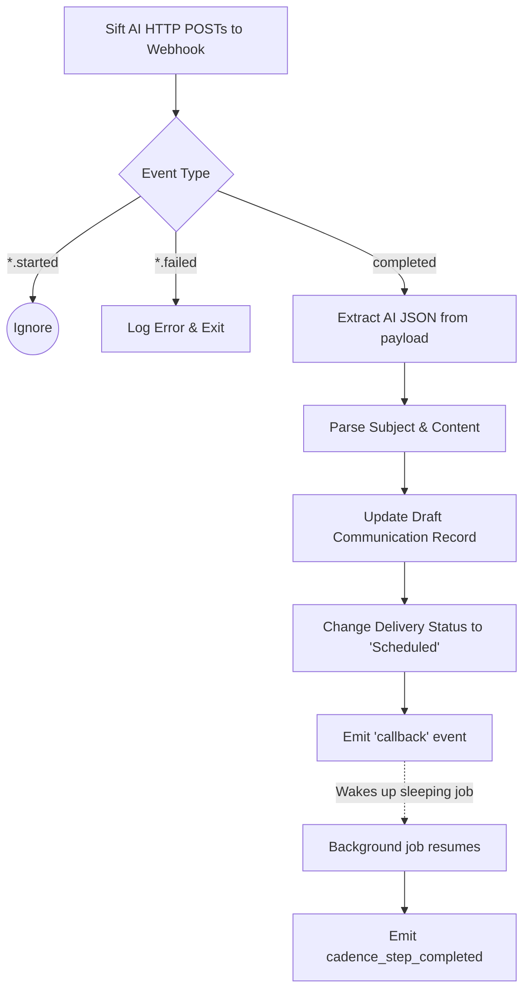

# Frappe Cadence Architecture & Lifecycle

This document provides a visual, graph-first overview of the lifecycle of the `frappe_cadence` app. It maps out how leads are enrolled into cadences, how steps are orchestrated asynchronously, and how AI-powered communication generation integrates via webhooks.

## The Big Picture: End-to-End Lifecycle

At a high level, the system works by listening to updates on `Cadence` and `CRM Lead` documents, enrolling matched leads, orchestrating a series of asynchronous steps, and dynamically generating content via AI (Sift) when requested.

---

## Phase 1: Evaluation & Enrollment

The lifecycle begins when a `CRM Lead` is updated or a `Cadence` blueprint is modified. The system uses an Abstract Syntax Tree (AST) to evaluate complex JSON conditions natively.

### Key Concepts
- **Idempotency:** A lead is never enrolled in the same Cadence twice.
- **Load Balancing:** Dynamically distributes outreach workloads among sales reps based on active tasks, not just static sequences.

---

## Phase 2: Orchestration & Step Sequencing

Once the `Multi Channel Cadence` (MCC) is created, it acts as the orchestrator. To keep the UI fast and avoid long-running blocking processes, it delegates all scheduled steps immediately to Frappe's background worker queues.

### Key Concepts
- **Asynchronous Enqueueing:** All steps are queued at once. 
- **Sequential Execution via Events:** Because steps are executed asynchronously, step 2 checks if step 1 is done. If not, it uses `wait_for_event("cadence_step_completed")` to pause its background thread, waking up only when the previous step finishes.

---

## Phase 3: Step Execution & Template Processing

When a background worker picks up a `process_schedule` job, it decides whether to generate a static message or delegate the generation to the Sift AI agent.

---

## Phase 4: Sift AI Webhook Callback

For AI-generated prompts, the job sleeps until Sift pings the webhook endpoint to deliver the generated content.

---

## Edge Cases & Architectural Nuances

### 1. Context Gathering (Bio & History)
When prompting the AI, the system requires extreme personalization. It achieves this by aggregating context:
- **User Bio:** Fetches the sender's configured biography. If it doesn't exist, the cadence halts and yields, waiting for `user_bio_created`.
- **History:** Queries the `History` doctype for the past 90 days. Crucially, if the Lead belongs to a `CRM Organization`, it fetches the history for the *entire organization*. This allows the AI to reference cross-lead interactions (e.g., "I know my colleague spoke with your CEO last week..."). It also parses visual screenshots into `image_url` payloads for multimodal AI processing.

### 2. Manual Resumption & Template Updates
If a template is marked as `"Disabled"`, `process_schedule` finishes successfully but **does not emit the completion event**. This causes all subsequent steps to wait forever in the background queue. 

**Updating a template from Disabled to Enabled does not magically resume sleeping jobs.** To apply template changes and wake up the cadence:
1. The user must manually pause the Multi Channel Cadence (change status to `Draft`).
2. Resume it (change status to `Scheduled`).
3. This triggers the orchestration logic to cancel the "sleeping/hung" jobs and re-enqueue them fresh, allowing them to pick up the newly "Enabled" template.

### 3. Provisioning & Annotation Isolation
During initial AI optimization or multi-step setups, MCCs can be placed in a `Provisioning` state.
The application isolates these records: the system explicitly filters out MCCs in `Provisioning` or `Error` states when querying for Leads in the `Email Template Annotation` tables, ensuring users only review and score annotations for active, fully-provisioned outreach flows.